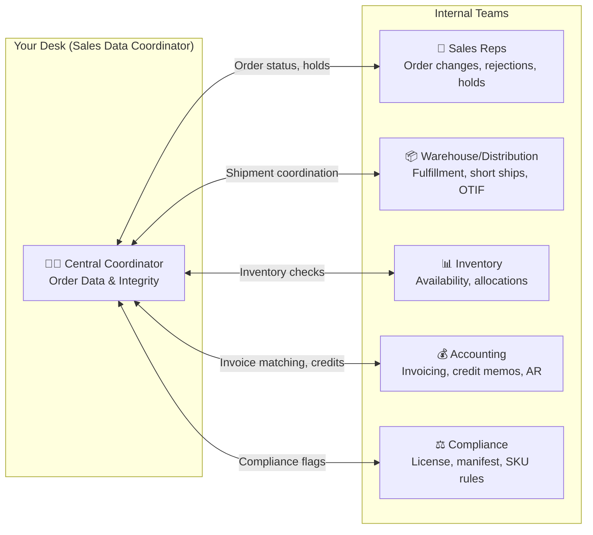

```mermaid
graph LR
    subgraph "Your Desk (Sales Data Coordinator)"
        HUB[🧑‍💼 Central Coordinator<br/>Order Data & Integrity]
    end

    subgraph "Internal Teams"
        SALES[🤝 Sales Reps<br/>Order changes, rejections, holds]
        WHSE[📦 Warehouse/Distribution<br/>Fulfillment, short ships, OTIF]
        INV[📊 Inventory<br/>Availability, allocations]
        ACCT[💰 Accounting<br/>Invoicing, credit memos, AR]
        COMP[⚖️ Compliance<br/>License, manifest, SKU rules]
    end

    HUB <-->|Order status, holds| SALES
    HUB <-->|Shipment coordination| WHSE
    HUB <-->|Inventory checks| INV
    HUB <-->|Invoice matching, credits| ACCT
    HUB <-->|Compliance flags| COMP
```
