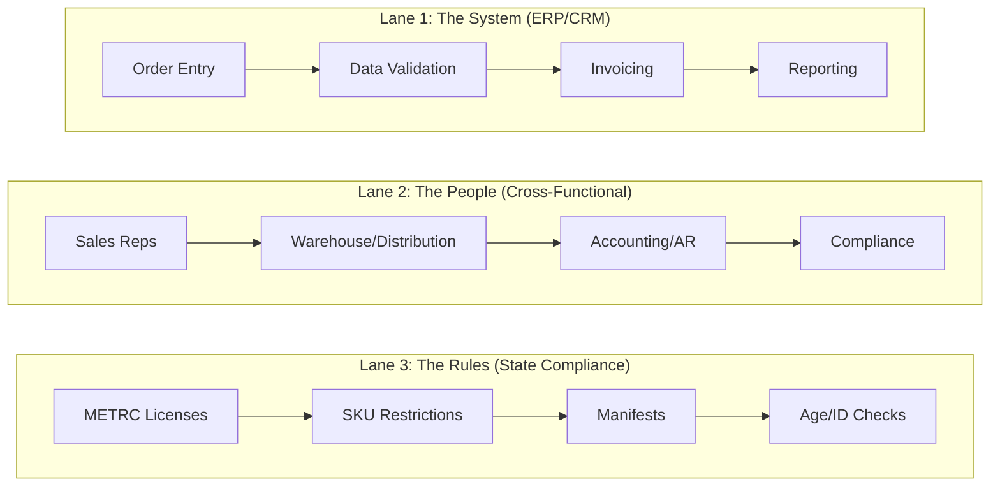

```mermaid
flowchart TB

    subgraph Lane1["Lane 1: The System (ERP/CRM)"]
        direction LR
        A[Order Entry] --> B[Data Validation] --> C[Invoicing] --> D[Reporting]
    end

    subgraph Lane2["Lane 2: The People (Cross-Functional)"]
        direction LR
        E[Sales Reps] --> F[Warehouse/Distribution] --> G[Accounting/AR] --> H[Compliance]
    end

    subgraph Lane3["Lane 3: The Rules (State Compliance)"]
        direction LR
        I[METRC Licenses] --> J[SKU Restrictions] --> K[Manifests] --> L[Age/ID Checks]
    end

    Lane1 ~~~ Lane2
    Lane2 ~~~ Lane3
```