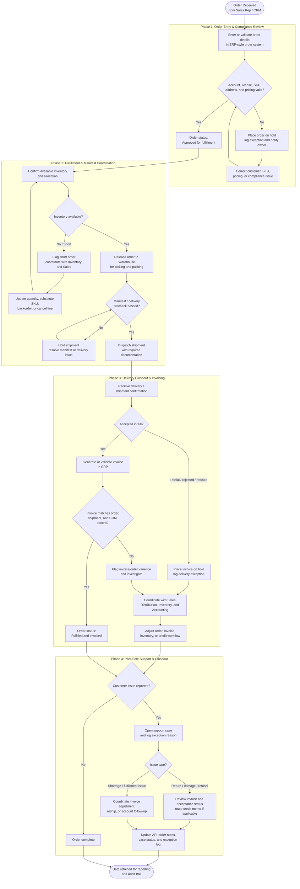

```mermaid
flowchart TD
    START([Order Received<br/>from Sales Rep / CRM]) --> A1

    subgraph PHASE1 [Phase 1: Order Entry & Compliance Review]
        A1[Enter or validate order details<br/>in ERP-style order system] --> A2{Account, license, SKU,<br/>address, and pricing valid?}
        A2 -->|No| A3[Place order on hold<br/>log exception and notify owner]
        A3 --> A4[Correct customer, SKU,<br/>pricing, or compliance issue]
        A4 --> A2
        A2 -->|Yes| A5[Order status:<br/>Approved for fulfillment]
    end

    A5 --> B1

    subgraph PHASE2 [Phase 2: Fulfillment & Manifest Coordination]
        B1[Confirm available inventory<br/>and allocation] --> B2{Inventory available?}
        B2 -->|No / Short| B3[Flag short order<br/>coordinate with Inventory and Sales]
        B3 --> B4[Update quantity, substitute SKU,<br/>backorder, or cancel line]
        B4 --> B1
        B2 -->|Yes| B5[Release order to Warehouse<br/>for picking and packing]
        B5 --> B6{Manifest / delivery<br/>precheck passed?}
        B6 -->|No| B7[Hold shipment<br/>resolve manifest or delivery issue]
        B7 --> B6
        B6 -->|Yes| B8[Dispatch shipment<br/>with required documentation]
    end

    B8 --> C1

    subgraph PHASE3 [Phase 3: Delivery Closeout & Invoicing]
        C1[Receive delivery / shipment confirmation] --> C2{Accepted in full?}
        C2 -->|Yes| C3[Generate or validate invoice<br/>in ERP]
        C2 -->|Partial / rejected / refused| C4[Place invoice on hold<br/>log delivery exception]
        C4 --> C5[Coordinate with Sales,<br/>Distribution, Inventory, and Accounting]
        C5 --> C6[Adjust order, invoice,<br/>inventory, or credit workflow]
        C3 --> C7{Invoice matches order,<br/>shipment, and CRM record?}
        C7 -->|No| C8[Flag invoice/order variance<br/>and investigate]
        C8 --> C5
        C7 -->|Yes| C9[Order status:<br/>Fulfilled and invoiced]
    end

    C6 --> D1
    C9 --> D1

    subgraph PHASE4 [Phase 4: Post-Sale Support & Closeout]
        D1{Customer issue reported?}
        D1 -->|Yes| D2[Open support case<br/>and log exception reason]
        D2 --> D3{Issue type?}
        D3 -->|Return / damage / refusal| D4[Review invoice and acceptance status<br/>route credit memo if applicable]
        D3 -->|Shortage / fulfillment issue| D5[Coordinate invoice adjustment,<br/>reship, or account follow-up]
        D4 --> D6[Update AR, order notes,<br/>case status, and exception log]
        D5 --> D6
        D1 -->|No| D7[Order complete]
    end

    D6 --> END([Data retained for reporting<br/>and audit trail])
    D7 --> END
```